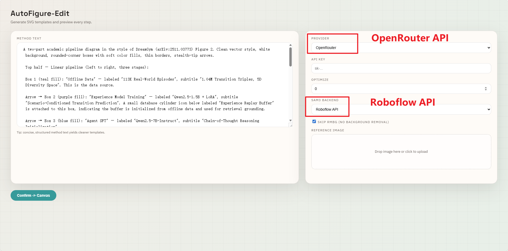

<div align="center">


# DIY AutoFigure-Edit

基于 [AutoFigure-Edit](https://github.com/ResearAI/AutoFigure-Edit) 的个人定制版本，降低上手门槛，开箱即用。

[](https://github.com/ResearAI/AutoFigure-Edit)
[](https://openreview.net/forum?id=5N3z9JQJKq)
[](https://www.python.org/)

</div>

---

## 相比原项目做了什么修改？

原项目在 pipeline 第 3 步强制依赖 HuggingFace 上的 `briaai/RMBG-2.0` 模型（需要申请访问权限 + 稳定访问 HuggingFace），在国内环境下经常遇到网络问题导致整个流程失败。

本仓库新增了 **Skip RMBG** 功能，允许跳过去背景步骤，直接使用裁切的原图嵌入 SVG，让整个流程无需 HuggingFace 即可顺利跑通。

<div align="center">
  
  <br>
  <em>Web 界面中新增的 Skip RMBG 选项</em>
</div>

### 修改文件一览

| 文件 | 修改内容 |
|:---|:---|
| `autofigure2.py` | 新增 `--skip_rmbg` CLI 参数；启用后跳过 RMBG-2.0，直接使用裁切图 |
| `server.py` | 后端 API 支持 `skip_rmbg` 字段并传递给子进程 |
| `web/index.html` | 设置面板新增 "Skip RMBG" 复选框 |
| `web/app.js` | 前端请求中携带 `skip_rmbg` 字段 |
| `.gitignore` | 新增，忽略缓存和输出目录 |

---

## 快速开始（3 步跑通）

### 第 1 步：安装依赖

```bash
# 创建并激活 conda 环境
conda create -n autofigure python=3.14 -y
conda activate autofigure

# 克隆项目并安装依赖（torch 默认安装 CPU 版本）
git clone https://github.com/tenderzada/DIY_AutoFigure.git
cd DIY_AutoFigure
pip install -r requirements.txt
```

> **需要 GPU 加速？** 在 `pip install -r requirements.txt` 之前先单独安装 GPU 版 PyTorch：
> ```bash
> pip install torch torchvision --index-url https://download.pytorch.org/whl/cu121
> ```

### 第 2 步：准备 API Key

本项目需要两个 API Key：

| 用途 | 服务商 | 获取地址 | 说明 |
|:---|:---|:---|:---|
| LLM（图像生成 + SVG 生成） | OpenRouter | https://openrouter.ai/keys | 注册后创建 Key，支持调用 Gemini/Claude 等多种模型 |
| SAM3 图像分割 | Roboflow | https://roboflow.com/ | 注册后在 Settings 中获取 API Key，免费额度即可使用 |

### 第 3 步：启动 Web 服务

```bash
python server.py
```

浏览器打开 `http://localhost:8000`，在页面中进行以下配置：

1. **Provider** 选择 `OpenRouter`
2. **API Key** 填入你的 OpenRouter API Key
3. **SAM3 Backend** 选择 `Roboflow API`
4. **SAM3 API Key** 填入你的 Roboflow API Key
5. **勾选 Skip RMBG**（跳过去背景，避免 HuggingFace 访问问题）
6. 左侧粘贴论文方法文本，点击 **Confirm -> Canvas** 开始生成

---

## 命令行方式（可选）

```bash
python autofigure2.py \
  --method_file paper.txt \
  --output_dir outputs/demo \
  --provider openrouter \
  --api_key "sk-or-v1-xxx" \
  --sam_backend roboflow \
  --sam_api_key "your-roboflow-key" \
  --skip_rmbg
```

---

## 常见问题

**Q: 不勾选 Skip RMBG 可以吗？**
可以，但需要：(1) 在 https://huggingface.co/briaai/RMBG-2.0 同意使用条款；(2) 运行 `huggingface-cli login` 登录；(3) 确保网络能访问 HuggingFace（可设置 `HF_ENDPOINT=https://hf-mirror.com` 使用镜像）。

**Q: 跳过去背景效果会差很多吗？**
裁切的图标会保留原图背景色，嵌入 SVG 后可能有色块。对于最终发表质量的插图建议还是开启 RMBG；如果只是快速预览或迭代，跳过完全够用。

**Q: 支持哪些 LLM Provider？**

| 供应商 | 说明 |
|:---|:---|
| **OpenRouter** | 支持 Gemini/Claude 等多种模型，推荐 |
| **Bianxie** | 兼容 OpenAI 接口 |
| **Gemini (Google)** | Google 官方 Gemini API |

---

## 致谢

本项目基于 [AutoFigure-Edit](https://github.com/ResearAI/AutoFigure-Edit)（ICLR 2026）。

```bibtex
@inproceedings{
zhu2026autofigure,
title={AutoFigure: Generating and Refining Publication-Ready Scientific Illustrations},
author={Minjun Zhu and Zhen Lin and Yixuan Weng and Panzhong Lu and Qiujie Xie and Yifan Wei and Yifan_Wei and Sifan Liu and QiYao Sun and Yue Zhang},
booktitle={The Fourteenth International Conference on Learning Representations},
year={2026},
url={https://openreview.net/forum?id=5N3z9JQJKq}
}
```

本项目基于 MIT 许可证开源。
